# LMS System Architecture & xAPI Flow Documentation

## Table of Contents
1. [System Overview](#system-overview)
2. [Architecture Diagram](#architecture-diagram)
3. [xAPI Flow - Complete Lifecycle](#xapi-flow-complete-lifecycle)
4. [Course Launch Flow](#course-launch-flow)
5. [Progress Tracking Flow](#progress-tracking-flow)
6. [Data Storage Architecture](#data-storage-architecture)
7. [Use Case Diagrams](#use-case-diagrams)
8. [Sequence Diagrams](#sequence-diagrams)
9. [Component Interactions](#component-interactions)
10. [xAPI Statement Mapping & Storage](#xapi-statement-mapping--storage)
11. [xAPI Statement Reading & Querying](#xapi-statement-reading--querying)

---

## System Overview

### Technology Stack

**Frontend:**
- React 18 with TypeScript
- Vite (Build Tool)
- React Router v6 (Routing)
- Axios (HTTP Client)
- Tailwind CSS (Styling)
- shadcn/ui (UI Components)
- Framer Motion (Animations)

**Backend:**
- Node.js (ES Modules)
- Express.js (Web Framework)
- JWT Authentication (bcrypt for password hashing)
- Azure Table Storage (Metadata - 7 tables)
- Azure Blob Storage (Course Files)

**Storage:**
- 7 Azure Tables for structured data
- Azure Blob Storage for course content files (HTML, JS, CSS, images, videos, audio)

---

## Architecture Diagram


---

## xAPI Flow - Complete Lifecycle

### 1. xAPI Statement Structure

**xAPI Statement Format:**
```json
{
  "id": "uuid",
  "actor": {
    "objectType": "Agent",
    "name": "User Name",
    "mbox": "mailto:user@example.com"
  },
  "verb": {
    "id": "http://adlnet.gov/expapi/verbs/completed",
    "display": { "en-US": "completed" }
  },
  "object": {
    "id": "urn:articulate:storyline:5Ujw93Dh98n",
    "objectType": "Activity"
  },
  "result": {
    "score": {
      "scaled": 0.95,
      "raw": 95,
      "max": 100
    },
    "completion": true
  },
  "timestamp": "2024-01-15T10:30:00Z",
  "context": {
    "registration": "reg-1234567890-abc"
  }
}
```

### 2. xAPI Statement Flow


### 3. xAPI Statement Storage Mapping

**Partition Key Strategy:**
- **Table**: `xapiStatements`
- **PartitionKey**: First part of user email (e.g., "userone" from "userone@csnhc.com")
- **RowKey**: Last part of statement ID (UUID)
- **Columns**:
  - `statement`: Full JSON statement (as string)
  - `verb`: Verb ID (for filtering)
  - `object`: Activity ID (for filtering)
  - `registration`: Registration ID (for filtering)

**Example Storage:**
```
PartitionKey: "userone"
RowKey: "9720afae-106a-4d71-97ab-18948531871b"
statement: '{"id":"...","actor":{...},"verb":{...},"object":{...}}'
verb: "http://adlnet.gov/expapi/verbs/initialized"
object: "urn:articulate:storyline:6E3U3EsX4QZ"
registration: "reg-1768237007913-fsvg64mpa"
```

**Storage Code Flow:**
```javascript
// 1. Extract partition key from actor
const mbox = statement.actor.mbox; // "mailto:userone@csnhc.com"
const email = mbox.replace('mailto:', ''); // "userone@csnhc.com"
const partitionKey = email.split('@')[0].substring(0, 50); // "userone"

// 2. Generate row key from statement ID
const statementId = statement.id; // "http://lms.example.com/statements/9720afae-..."
const rowKey = statementId.split('/').pop(); // "9720afae-106a-4d71-97ab-18948531871b"

// 3. Create entity
const entity = {
  partitionKey: partitionKey,
  rowKey: rowKey,
  statement: JSON.stringify(statement), // Full statement as JSON string
  verb: statement.verb?.id || '', // For filtering
  object: statement.object?.id || '', // For filtering
  registration: statement.context?.registration || null // For filtering
};

// 4. Save to Azure Table
await client.upsertEntity(entity, 'Replace');
```

### 4. xAPI Statement Reading

**Query Process:**
1. **By User**: Query by PartitionKey (user email prefix)
2. **By Activity**: Filter by `object` column (activity ID)
3. **By Verb**: Filter by `verb` column
4. **By Registration**: Filter by `registration` column

**Code Flow:**
```javascript
// 1. Query statements
queryStatements({
  agent: { mbox: "mailto:user@example.com" },
  activity: "urn:articulate:storyline:5Ujw93Dh98n",
  limit: 1000
})

// 2. Build OData filter
const partitionKey = getStatementPartitionKey(agent); // "userone"
filter = `PartitionKey eq '${partitionKey}' and object eq 'urn:articulate:storyline:5Ujw93Dh98n'`

// 3. Query Azure Table
listEntities({ queryOptions: { filter } })

// 4. Parse JSON statements
entities.map(entity => JSON.parse(entity.statement))
```

**Reading Code Example:**
```javascript
// From xapi-lrs-azure.js
export async function queryStatements(query) {
  const client = getTableClient('STATEMENTS');
  let filter = '';
  
  // Filter by agent (partition key)
  if (query.agent) {
    const partitionKey = getStatementPartitionKey(query.agent);
    filter = `PartitionKey eq '${partitionKey}'`;
  }
  
  // Filter by activity
  if (query.activity) {
    const activityId = typeof query.activity === 'string' 
      ? query.activity 
      : query.activity.id;
    if (filter) filter += ' and ';
    filter += `object eq '${activityId}'`;
  }
  
  // Query and parse
  const entities = [];
  for await (const entity of client.listEntities({ 
    queryOptions: { filter: filter || undefined } 
  })) {
    entities.push(JSON.parse(entity.statement));
  }
  
  return { status: 200, data: { statements: entities } };
}
```

---

## Course Launch Flow


**Launch URL Structure:**
```
http://localhost:3001/course/{coursePath}/index_lms.html?
  endpoint=http://localhost:3001/xapi&
  auth=Basic {base64(email:token)}&
  actor={"objectType":"Agent","name":"User","mbox":"mailto:user@example.com"}&
  registration=reg-1234567890-abc&
  activityId=urn:articulate:storyline:5Ujw93Dh98n
```

**Launch Code Flow:**
```javascript
// 1. User clicks course → Frontend calls API
POST /api/courses/:courseId/launch
Headers: { Authorization: "Bearer <token>" }

// 2. Backend verifies token
const user = auth.verifyToken(token);

// 3. Get course from Azure Tables
const course = await coursesStorage.getCourseById(courseId);

// 4. Update progress
await progressStorage.updateProgress(userEmail, courseId, {
  enrollmentStatus: 'enrolled',
  completionStatus: 'in_progress',
  attempts: currentAttempts + 1
});

// 5. Generate registration ID
const registrationId = `reg-${Date.now()}-${Math.random().toString(36).substr(2, 9)}`;

// 6. Create actor
const actor = {
  objectType: 'Agent',
  name: user.name || user.email,
  mbox: `mailto:${user.email}`
};

// 7. Build launch URL
const params = new URLSearchParams({
  endpoint: `${baseUrl}/xapi`,
  auth: `Basic ${Buffer.from(`${user.email}:${token}`).toString('base64')}`,
  actor: JSON.stringify(actor),
  registration: registrationId,
  activityId: course.activityId
});

const launchUrl = `${baseUrl}/course/${coursePath}/${course.launchFile}?${params.toString()}`;

// 8. Return to frontend
res.json({ course, launchUrl, registrationId });
```

---

## Progress Tracking Flow


**Progress Calculation Logic:**

1. **Completion Status:**
   - `not_started`: No statements
   - `in_progress`: Statements exist, no completion verb
   - `completed`: Found "completed" verb
   - `passed`: Found "passed" verb

2. **Time Spent:**
   - Calculate gaps between consecutive statements
   - Exclude gaps > 5 minutes (user left)
   - Sum remaining gaps

3. **Score:**
   - Extract from `result.score.scaled` (0-1) → convert to 0-100
   - Or use `result.score.raw` with `max` value

4. **Progress Percent:**
   - `completed`/`passed`: 100%
   - `in_progress`: Estimate based on statement count (max 95%)

**Progress Calculation Code:**
```javascript
// 1. Query all statements for user
const allStatements = await xapiLRS.queryStatements({
  agent: { mbox: `mailto:${userEmail}` },
  limit: 1000
});

// 2. Filter by activity ID (base + slide activities)
const statements = allStatements.filter(s => {
  const objectId = s.object?.id || '';
  return objectId === activityId || objectId.startsWith(activityId + '/');
});

// 3. Determine completion status
let completionStatus = 'not_started';
if (statements.length > 0) {
  completionStatus = 'in_progress';
}

const completedStatement = statements.find(s => {
  const verbId = s.verb?.id || '';
  return verbId.includes('completed') || verbId.includes('passed');
});

if (completedStatement) {
  completionStatus = completedStatement.verb?.id?.includes('passed') 
    ? 'passed' 
    : 'completed';
}

// 4. Calculate time spent
const sortedStatements = statements.sort((a, b) => 
  new Date(a.timestamp) - new Date(b.timestamp)
);

let timeSpent = 0;
const MAX_GAP_SECONDS = 300; // 5 minutes

for (let i = 0; i < sortedStatements.length - 1; i++) {
  const gap = (new Date(sortedStatements[i + 1].timestamp) - 
               new Date(sortedStatements[i].timestamp)) / 1000;
  if (gap > 0 && gap <= MAX_GAP_SECONDS) {
    timeSpent += gap;
  }
}

// 5. Extract score
let score = null;
if (completedStatement?.result?.score) {
  const scaled = completedStatement.result.score.scaled;
  if (scaled !== undefined) {
    score = Math.round(scaled * 100);
  }
}

// 6. Calculate progress percent
let progressPercent = 0;
if (completionStatus === 'completed' || completionStatus === 'passed') {
  progressPercent = 100;
} else if (completionStatus === 'in_progress') {
  progressPercent = Math.min(95, Math.round((statements.length / 80) * 100));
}

// 7. Update UserProgress table
await updateProgress(userEmail, courseId, {
  completionStatus,
  score,
  timeSpent,
  progressPercent,
  startedAt: sortedStatements[0]?.timestamp,
  completedAt: completedStatement?.timestamp
});
```

---

## Data Storage Architecture

### Azure Tables Structure

```mermaid
erDiagram
    USERS ||--o{ USER_PROGRESS : "has"
    COURSES ||--o{ USER_PROGRESS : "tracked_in"
    USERS ||--o{ XAPI_STATEMENTS : "generates"
    COURSES ||--o{ XAPI_STATEMENTS : "activity"
    USERS ||--o{ XAPI_STATE : "resumes"
    COURSES ||--o{ XAPI_STATE : "activity"
    
    USERS {
        string PartitionKey "user"
        string RowKey "email"
        string userId
        string email
        string name
        string password "hashed"
        string role
        datetime createdAt
    }
    
    COURSES {
        string PartitionKey "courses"
        string RowKey "courseId"
        string courseId
        string title
        string activityId
        string launchFile
        string coursePath
    }
    
    USER_PROGRESS {
        string PartitionKey "userEmail"
        string RowKey "courseId"
        string enrollmentStatus
        string completionStatus
        number score
        number timeSpent
        number progressPercent
        datetime enrolledAt
        datetime completedAt
    }
    
    XAPI_STATEMENTS {
        string PartitionKey "userEmailPrefix"
        string RowKey "statementId"
        string statement "JSON"
        string verb
        string object
        string registration
    }
    
    XAPI_STATE {
        string PartitionKey "activityId|user"
        string RowKey "stateId|registration"
        string state "JSON/string"
    }
```



### Partition Key Strategy

| Table | Partition Key | Purpose | Example |
|-------|--------------|---------|---------|
| `Users` | `"user"` | Single partition for all users | `"user"` |
| `Courses` | `"courses"` | Single partition for all courses | `"courses"` |
| `UserProgress` | User email | Group progress by user | `"userone@csnhc.com"` |
| `xapiStatements` | Email prefix | Distribute statements by user | `"userone"` |
| `xapiState` | `activityId\|user` | Group state by course+user | `"urn:articulate:storyline:6E3U3EsX4QZ\|userone"` |
| `xapiActivityProfiles` | Activity ID | Group profiles by course | `"urn:articulate:storyline:6E3U3EsX4QZ"` |
| `xapiAgentProfiles` | Email prefix | Group profiles by user | `"userone"` |

### Table Details

#### 1. Users Table
- **PartitionKey**: `"user"` (single partition)
- **RowKey**: User email (lowercase)
- **Purpose**: User accounts and authentication
- **Key Fields**: email, name, password (hashed), role

#### 2. Courses Table
- **PartitionKey**: `"courses"` (single partition)
- **RowKey**: Course ID (slugified title)
- **Purpose**: Course catalog metadata
- **Key Fields**: courseId, title, activityId, launchFile, coursePath

#### 3. UserProgress Table
- **PartitionKey**: User email
- **RowKey**: Course ID
- **Purpose**: Track enrollment, completion, scores, time spent
- **Key Fields**: enrollmentStatus, completionStatus, score, timeSpent, progressPercent

#### 4. xapiStatements Table
- **PartitionKey**: Email prefix (first part before @)
- **RowKey**: Statement ID (UUID)
- **Purpose**: Store all xAPI statements
- **Key Fields**: statement (JSON), verb, object, registration

#### 5. xapiState Table
- **PartitionKey**: `activityId|userPrefix`
- **RowKey**: `stateId` or `stateId|registration`
- **Purpose**: Resume/bookmark state
- **Key Fields**: state (string/JSON)

#### 6. xapiActivityProfiles Table
- **PartitionKey**: Activity ID
- **RowKey**: Profile ID
- **Purpose**: Course-level settings/preferences

#### 7. xapiAgentProfiles Table
- **PartitionKey**: Email prefix
- **RowKey**: Profile ID
- **Purpose**: User-level settings/preferences

---

## Use Case Diagrams

### Learner Use Cases


### Admin Use Cases


### System Use Cases


---

## Sequence Diagrams

### Complete Course Launch & Tracking Sequence


### Resume State Flow


---

## Component Interactions

### Frontend Components


### Backend Services


---

## Key xAPI Verbs Used

| Verb ID | Purpose | When Sent |
|---------|---------|-----------|
| `http://adlnet.gov/expapi/verbs/initialized` | Course started | On course load |
| `http://adlnet.gov/expapi/verbs/launched` | Course launched | On course launch |
| `http://adlnet.gov/expapi/verbs/experienced` | User interaction | On slide/view change |
| `http://adlnet.gov/expapi/verbs/completed` | Course completed | On course completion |
| `http://adlnet.gov/expapi/verbs/passed` | Course passed | On passing assessment |
| `http://adlnet.gov/expapi/verbs/failed` | Course failed | On failing assessment |
| `http://adlnet.gov/expapi/verbs/interacted` | User interaction | On button click, download, etc. |

---

## Data Flow Summary

1. **User Authentication** → JWT Token → Stored in localStorage
2. **Course Launch** → Generate Registration ID → Build Launch URL → Load Course
3. **Course Interaction** → xAPI Statements → Azure Tables → Auto-sync Progress
4. **Progress Calculation** → Query Statements → Analyze → Update UserProgress
5. **Resume State** → Save/Load from xapiState Table → Restore Course Position

---

## Storage Queries

### Common Query Patterns

**1. Get User Progress:**
```javascript
// PartitionKey = userEmail, RowKey = courseId
const progress = await client.getEntity(
  "userone@csnhc.com", 
  "abuse-neglect-reference-document"
);
```

**2. Get All Statements for User:**
```javascript
// PartitionKey = email prefix
const statements = [];
for await (const entity of client.listEntities({ 
  queryOptions: { 
    filter: "PartitionKey eq 'userone'" 
  } 
})) {
  statements.push(JSON.parse(entity.statement));
}
```

**3. Get Statements for Course:**
```javascript
// Filter by object column
const statements = [];
for await (const entity of client.listEntities({ 
  queryOptions: { 
    filter: "object eq 'urn:articulate:storyline:6E3U3EsX4QZ'" 
  } 
})) {
  statements.push(JSON.parse(entity.statement));
}
```

**4. Get Resume State:**
```javascript
// PartitionKey = activityId|user, RowKey = resume
const state = await client.getEntity(
  "urn:articulate:storyline:6E3U3EsX4QZ|userone", 
  "resume"
);
```

---

## File Structure

```
LMS/
├── frontend/
│   ├── src/
│   │   ├── pages/
│   │   │   ├── Login.tsx
│   │   │   ├── Register.tsx
│   │   │   ├── Courses.tsx
│   │   │   ├── CoursePlayer.tsx
│   │   │   ├── ProgressDashboard.tsx
│   │   │   └── AdminPanel.tsx
│   │   ├── components/
│   │   │   ├── layout/
│   │   │   └── ui/
│   │   ├── services/
│   │   │   ├── api.ts
│   │   │   └── auth.ts
│   │   └── App.tsx
│   └── vite.config.ts
├── backend/
│   ├── server.js              # Main Express server
│   ├── auth.js                # Authentication service
│   ├── courses-storage.js     # Course CRUD operations
│   ├── progress-storage.js     # Progress tracking
│   ├── xapi-lrs-azure.js      # xAPI LRS implementation
│   ├── users-storage.js       # User management
│   ├── blob-storage.js        # Azure Blob Storage
│   └── azure-tables.js        # Azure Table Storage config
└── README.md
```

---

## API Endpoints

### Authentication
- `POST /api/auth/register` - Register new user
- `POST /api/auth/login` - Login and get token
- `GET /api/auth/me` - Get current user info

### Courses
- `GET /api/courses` - Get all courses (with enrollment status)
- `GET /api/courses/:courseId` - Get specific course
- `POST /api/courses/:courseId/launch` - Launch course (returns launch URL)

### xAPI LRS
- `POST /xapi/statements` - Store xAPI statement(s)
- `GET /xapi/statements` - Query statements
- `GET /xapi/statements/:id` - Get specific statement
- `PUT /xapi/statements` - Update statement
- `GET /xapi/activities/state` - Get activity state (resume)
- `PUT /xapi/activities/state` - Save activity state
- `DELETE /xapi/activities/state` - Delete state
- `GET/PUT/DELETE /xapi/activities/profile` - Activity profiles
- `GET/PUT/DELETE /xapi/agents/profile` - Agent profiles

### Course Files
- `GET /course/*` - Serve course files from Azure Blob Storage

### Admin
- `GET /api/admin/courses` - Get all courses (admin)
- `GET /api/admin/progress` - Get all user progress (admin)

---

## Summary

This LMS system uses:
- **xAPI (Tin Can API)** for tracking learner interactions
- **Azure Table Storage** for structured data (7 tables)
- **Azure Blob Storage** for course content files
- **Real-time progress syncing** when statements are received
- **Resume functionality** using xAPI State API
- **Partition key strategy** for efficient queries and scalability

The system automatically:
- Tracks all course interactions via xAPI statements
- Calculates progress, time spent, and scores
- Saves resume state for course continuation
- Syncs progress in real-time as learners interact
- Handles Storyline courses with proper xAPI configuration

---

## xAPI Verb Tracking System

### Overview

The LMS includes a comprehensive xAPI verb tracking system that automatically monitors all verbs (standard and custom) from the [xAPI Verb Registry](https://registry.tincanapi.com/#home/verbs). This system provides statistics, logging, and configurable handlers for custom verbs.

### Architecture


### Features

1. **Automatic Tracking**: All verbs are automatically tracked when statements are received
2. **Statistics**: Real-time statistics on verb usage (count, unique users, unique activities)
3. **Custom Verb Support**: Configure custom verbs with specific actions
4. **Admin UI**: Visual interface to view statistics and manage custom verbs
5. **Intelligent Detection**: Automatically detects verb categories based on verb ID patterns

### Standard Verbs Supported

The system recognizes standard verbs from the ADL registry:

**Completion Verbs:**
- `http://adlnet.gov/expapi/verbs/completed` - Marks course as completed
- `http://adlnet.gov/expapi/verbs/passed` - Marks course as passed
- `http://adlnet.gov/expapi/verbs/failed` - Marks course as failed

**Progress Verbs:**
- `http://adlnet.gov/expapi/verbs/initialized` - Marks course as started
- `http://adlnet.gov/expapi/verbs/launched` - Marks course as launched
- `http://adlnet.gov/expapi/verbs/experienced` - Tracks user interaction
- `http://adlnet.gov/expapi/verbs/progressed` - Updates progress

**Interaction Verbs:**
- `http://adlnet.gov/expapi/verbs/interacted` - Tracks interaction
- `http://adlnet.gov/expapi/verbs/answered` - Tracks answer
- `http://adlnet.gov/expapi/verbs/attempted` - Tracks attempt
- `http://adlnet.gov/expapi/verbs/downloaded` - Tracks download
- `http://adlnet.gov/expapi/verbs/shared` - Tracks share
- `http://adlnet.gov/expapi/verbs/bookmarked` - Tracks bookmark

### Custom Verb Configuration

Custom verbs can be added via the Admin UI or API:

**Via Admin UI:**
1. Navigate to Admin Panel → xAPI Verbs tab
2. Click "Add Custom Verb"
3. Enter verb ID (full IRI)
4. Select category (completion, progress, interaction, custom)
5. Select action (mark_completed, mark_passed, track_interaction, etc.)
6. Add description
7. Save

**Via API:**
```javascript
POST /api/admin/verbs
{
  "verbId": "https://example.com/verbs/document-downloaded",
  "config": {
    "category": "completion",
    "action": "mark_completed",
    "description": "Document downloaded - marks course as completed"
  }
}
```

### Verb Statistics

Statistics are automatically collected for all verbs:

- **Total Count**: Number of times the verb was used
- **Unique Users**: Number of distinct users who used the verb
- **Unique Activities**: Number of distinct activities where the verb was used
- **Last Used**: Timestamp of last usage

### Verb Detection Logic

The system uses intelligent detection for unknown verbs:

1. **Exact Match**: Checks against standard and custom verb configurations
2. **Keyword Detection**: Analyzes verb ID for keywords:
   - "completed" or "complete" → completion category
   - "passed" or "pass" → completion category (passed)
   - "failed" or "fail" → completion category (failed)
   - "initialized", "launched", "started" → progress category
   - "downloaded" or "download" → interaction category
3. **Default**: Unknown verbs are categorized as "unknown" and tracked

### Integration Points

**xAPI LRS Integration** (`backend/xapi-lrs-azure.js`):
- Automatically tracks verb usage when statements are saved
- Logs custom/unknown verbs for monitoring
- Executes custom handlers if configured

**Progress Storage Integration** (`backend/progress-storage.js`):
- Uses verb tracker to detect completion verbs (instead of hardcoded checks)
- Uses verb tracker to detect start verbs
- Works with any completion/start verb (standard or custom)

**Admin API** (`backend/server.js`):
- `GET /api/admin/verbs` - Get statistics and configurations
- `POST /api/admin/verbs` - Add custom verb
- `PUT /api/admin/verbs/:verbId` - Update custom verb
- `DELETE /api/admin/verbs/:verbId` - Remove custom verb

### Example: Document Download Completion

For document courses where download = completion:

1. **Add Custom Verb**:
   ```json
   {
     "verbId": "https://example.com/verbs/document-downloaded",
     "config": {
       "category": "completion",
       "action": "mark_completed",
       "description": "Document downloaded - marks course as completed"
     }
   }
   ```

2. **System Behavior**:
   - When statement with this verb is received, it's tracked
   - Progress calculation recognizes it as a completion verb
   - Course is marked as completed automatically

### Monitoring

Custom and unknown verbs are automatically logged:
```
[Verb Tracker] Custom/Unknown verb detected: https://example.com/verbs/custom-action
[Verb Tracker] User: user@example.com, Activity: urn:articulate:storyline:xxx
[xAPI Verb Tracker] Category: interaction, Action: track_interaction
```

### Future Enhancements

- Persist statistics to Azure Tables for historical analysis
- Support JavaScript handler functions for custom verbs
- Verb usage analytics and reporting
- Export verb statistics to CSV/JSON

---

## Additional Resources

- [xAPI Specification](https://github.com/adlnet/xAPI-Spec)
- [Azure Table Storage Documentation](https://docs.microsoft.com/en-us/azure/storage/tables/)
- [Azure Blob Storage Documentation](https://docs.microsoft.com/en-us/azure/storage/blobs/)
- [Articulate Storyline xAPI Guide](https://articulate.com/support/article/Storyline-360-Publishing-for-xAPI-Tin-Can-API)

---

**Document Version**: 1.1  
**Last Updated**: January 2024  
**Author**: LMS Development Team

### Changelog

**v1.1 (January 2024)**
- Added xAPI Verb Tracking System documentation
- Added verb statistics and custom verb management
- Updated progress calculation to use verb tracker

**v1.0 (January 2024)**
- Initial documentation release
